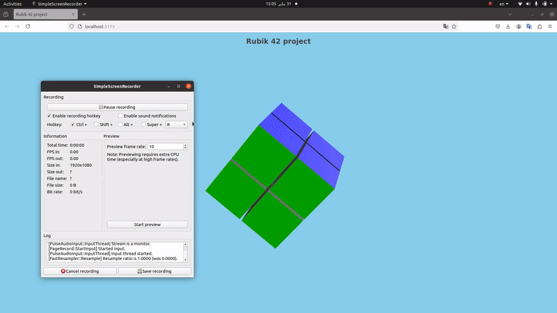

# Rubik's Cube Visualizer + algo

## Overview
This project is a **Rubik's Cube visualizer** built using **Three.js**. It currently renders a simple **2x2 Rubik's Cube**, and the next step is to develop an algorithm to solve a **3x3 Rubik's Cube** in either **Python** or **C++** and parse the output to Three.js for visualization.



## Features
- **3D Rendering** of a 2x2 Rubik's Cube using Three.js.
- **Camera/keyboard Controls** to navigate around the cube + moving the cubelets with the keyboard 
- **Scene Management** for organizing rendering logic.
- **Modular Design** with separate files for different functionalities.

## Next Steps
- Implement a **3x3 Rubik's Cube solving algorithm** in Python or C++.
- Parse the algorithm's output and integrate it with **Three.js** for visualization.
- Enhance interactivity and animations (maybe , maybe not)

## Installation and Setup
To set up and run the project, follow these steps:

### 1. Clone the Repository
```sh
git clone <repository-url>
cd rubik_cube_42/src
```

### 2. Install Dependencies
```sh
npm install
```

### 3. Run the Development Server
This project uses **Vite** for local development. Start the server with:
```sh
npm run dev
```
The app will be available at **http://localhost:5173/**.

## Folder Structure
```
.
├── assets/                     # Textures and assets used in the project
│   └── textures/               # Texture files for the Rubik's Cube
├── index.html                  # Main HTML file that loads the project
├── main.js                     # Entry point for the JavaScript application
├── styles/                     # CSS styles for the project
│   └── main.css                # Main stylesheet
└── World/                      # Contains all Three.js components
    ├── components/             # 3D objects and camera setup
    │   ├── camera.js           # Camera setup
    │   ├── cube.js             # Cube rendering logic
    │   ├── lights.js           # Scene lighting
    │   ├── scene.js            # Scene management
    │   └── simpleCube.js       # Basic cube rendering
    ├── systems/                # Rendering and interaction systems
    │   ├── controls.js         # User controls for interacting with the cube
    │   ├── Loop.js             # Animation loop
    │   ├── renderer.js         # WebGL renderer
    │   └── Resizer.js          # Handles screen resizing
    └── World.js                # Main world setup combining components
```

## Usage
- Open **http://localhost:5173/** in your browser.
- Interact with the 2x2 Rubik's Cube using the mouse and the keyboard 
- Modify `World/components/cube.js` to change cube behavior.
- Future updates will include a 3x3 solving algorithm integration.

## Dependencies
- **Three.js** (for 3D rendering)
- **Vite** (for fast development)

## License
This project is licensed under the **MIT License**.


